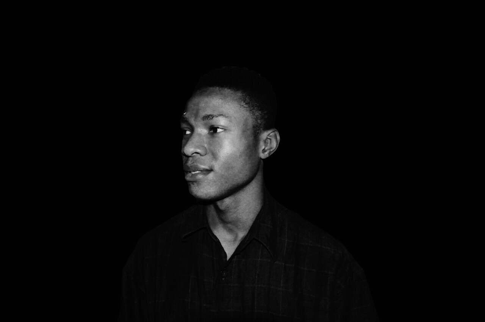

# Hi 👋, I'm Eunit99 ( *Emmauel* *Uchenna* )

I am Emmanuel Uchenna, freelance ``chat bot developer`` | ``web developer`` | ``web designer`` | ``frontend developer`` | ``graphic designer``

I am a seasoned frontend web developer. **HTML5**, **CSS3**, **Javascript**, **jQuery**, **VueJS**, and **ReactJS** are my web development tools. I am familiar with responsive design techniques, approaching all projects with a mobile-first view, ensuring that what I produce will look great regardless of the type of device it is being viewed on.

I love creating websites and also programming. This is all my motivation pushing me to improve my skills in multiple disciplines such as: UX design, UI design, frontend development, I think these are just the titles for companies. For me it is the path for turning ideas into live applications.
<!--
**Eunit99/eunit99** is a ✨ _special_ ✨ repository because its `README.md` (this file) appears on your GitHub profile.

Here are some ideas to get you started:

- 🔭 I’m currently working on ...
- 🌱 I’m currently learning ...
- 👯 I’m looking to collaborate on ...
- 🤔 I’m looking for help with ...
- 💬 Ask me about ...
- 📫 How to reach me: ...
- 😄 Pronouns: ...
- ⚡ Fun fact: ...
-->
